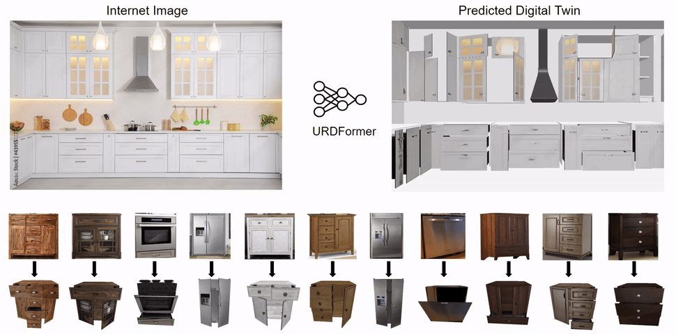

# URDFormer

[**URDFormer: A Pipeline for Constructing Articulated Simulation Environments from Real-World Images**](https://drive.google.com/file/d/1vXcBgf--ySQWeh3VFIiigAV8_cZi_Kzv/view?usp=sharing)  
[Zoey Chen](https://qiuyuchen14.github.io/), [Aaron Walsman](https://aaronwalsman.com/), 
[Marius Memmel](https://memmelma.github.io/), [Kaichun Mo](https://kaichun-mo.github.io/),
[Alex Fang](https://scholar.google.com/citations?user=kD9uKC4AAAAJ&hl=en), 
[Karthikeya Vemuri](https://www.linkedin.com/in/karthikeya-vemuri/),
[Alan Wu](https://www.linkedin.com/in/alan-wu-501a93202/),
[Dieter Fox*](https://homes.cs.washington.edu/~fox/),  [Abhishek Gupta*](https://abhishekunique.github.io/) 

[website](https://urdformer.github.io/), [paper](https://drive.google.com/file/d/1vXcBgf--ySQWeh3VFIiigAV8_cZi_Kzv/view?usp=sharing)

URDFormer represents a pipeline for large-scale simulation generation from real-world images. 
Given an image, whether sourced from the internet or captured with a phone, 
URDFormer predicts its corresponding interactive 'digital twin' in the URDF format. 
This URDF can then be loaded into a simulator to train robots for various tasks. 
For more details and visualizations, please visit our [website](https://urdformer.github.io/).




## Installation

1 . Clone URDFormer repo (this might take a few minutes):
```bash
git clone https://github.com/urdformer/urdformer.git
cd urdformer
```
2 . Create an new environment (we only tested URDFormer with python 3.9)
```bash
conda create -n urdformer python=3.9
conda activate urdformer
```

3 . Install all the required packages:
```bash
pip install -r requirements.txt
```

4 . Install pytorch version based on your cuda version. We only tested URDFormer on torch==1.12.1+cu113. 

5 . Download all the checkpoints
[Download link](https://drive.google.com/drive/folders/1FPlE1ui2jqjOcaflBZ-9K11YBV_1mD_f?usp=sharing)
First create two folders to save pretrained models:
```bash
mkdir checkpoints
mkdir backbones
```

(a) Download URDFormer checkpoints for both global scenes and parts (`global.pth`, `part.pth`), and place them under `checkpoints`

(b) Download backbone checkpoint (`mae_pretrain_hoi_vit_small.pth`) and place it under `backbones`

(c) Download Finetuned GroudingDINO models (`kitchen_souped.pth` and `object_souped.pth`) with modelsoup method for object-level and scene-level, and place them
under `grounding_dino`

After this step, your folder will look like:
```bash
urdformer/
├── backbones/
│   ├── mae_pretrain_hoi_vit_small.pth
├── checkpoints/
│   ├── global.pth
│   └── part.pth
├── grounding_dino/
│   ├── kitchen_souped.pth
│   └── object_souped.pth
...
```
6 . Install packages required for running GroundingDINO
```bash
pip install -U openmim
mim install mmengine
mim install "mmcv>=2.0.0"

cd grounding_dino
pip install -v -e .
cd ..
```

## Quickstart
 
If you just want to visualize examples we provide, simply run:
```bash
python demo.py --scene_type object --texture
```
If you are running this the first time, this might take a few minutes to download pretrained weights.
## Details
Put all your images under `images`, and the urdf predictions by default will be saved under `output`. URDFormer is only trained on 5 categories of 
objects: "cabinet", "oven", "dishwasher", "fridge" and "washer" (see `groundingdino/detection.py`), and one type of global scene "kitchen". 
Disclaimer: URDFormer was trained on dataset of objects with handles, so it works better on kitchens when handles on the cabinets are visible.


To run URDFormer for your image, there are 3 steps: (1) getting bounding boxes for objects and parts (2) Get textures (optional) (3) get URDF prediction. 

1 . First step for URDFormer is getting reliable bounding boxes for parts and objects. To do this, we provide finetuned GroundingDINO weights with model soup approach, 
followed by an interactive GUI for user to further refine the boxes. Usually the prediction works fairly well for single object such as cabinets, but requries 
further refinements for global scenes. 
```bash
python get_bbox.py --scene_type object
```
Note that you can also specify names such as "cabinet" or "washer" under `--scene_type` for better prompting used for GroundingDINO. Please use "--scene_type kitchen" when working with global scene
prediction. All the predicted bboxes are saved in `groundingdino/labels`. We also have a further postprocessing step to remove duplicated boxes and save filtered results in `groundingdino/labels_filtered`

The GUI interface is pretty straightforward, the image is first initialized with predicted boxes from GroundingDINO, you can right click to select boxes, and choose from `delete` (remove all the selected boxes)
or combine (combine all the selected boxes). You can simply click and drag to add boxes. When you are ready, click `confirm`. All the boxes will be saved into `groundingdino/labels_manual`. 
Note: Valid boxes are "drawer, door, handle, knob" for cabinets, and "door, drawer, handle" for dishwasher, oven, fridge and "door" for washer. Currently URDFormer doesn't support "oven knob".


Tips on GUI: For object-level boxes, we only care about part boxes such as `drawer` or `handle`, so please remove boxes on the entire object. For kitchen images, you first need to label boxes on objects only, after confirming the object boxes, it will go
into each box and ask GroundingDINO or user for part boxes. For kitchen images, it's better to keep object boxes simple (group 2-3 doors together) for global URDFormer, and leave more complex part reasoning for part URDFormer.


2 . [Optional] Second step is to get textures. We simply crop the original image using the bbox obtained in step 1. This step leverages stable diffusion for better/diverse textures such as removing handles. We import these images into a texture UV map template,
```bash
python get_texture.py --scene_type object
```
Please use `--scene_type kitchen` when doing kitchen images.
Note that this step will take about a few second to 1min per object depending on numbers of parts the object has. Alternatively, you can skip this step if you only want to generate URDFs. 
By default, the texture for inside the drawer is black, but you can change it to any images you like.
Disclaimer: We used stable diffusion for inpainting handle regions, the generated images might be slightly different at different runs.


3 . Last step is the URDF prediction.
For single object prediction, run:
```bash
python demo.py --scene_type object --texture
```
If you have skipped step 2, you can simply remove `--texture`. 

For kitchen prediction, run:
```bash
python demo.py --scene_type kitchen --texture
```
You will see animated visualization in the pybullet GUI window (press `G` for better visualization). 


For mesh randomization, you can add `--random`, we currently only support randomization on cabinet objects.

```bash
python demo.py --scene_type object --texture --random
```

All URDF results are saved under `output`. We provide basic script for sanity check:
```bash
python urdf_test.py --name label3.urdf
```
change `label3.urdf` to your urdf filename that you want to visualize. 


## Training

Details on how to generate data and train URDFormer are coming soon!


## Citations
**URDFormer**
```bibtex
@misc{urdformer_2024,
    title={URDFormer: A Pipeline for Constructing Articulated Simulation Environments from Real-World Images},
    author  = {Zoey Chen and Aaron Walsman and Marius Memmel and Kaichun Mo and Alex Fang and Karthikeya Vemuri and Alan Wu and Dieter Fox and Abhishek Gupta},
    year = {2024},
}
```

## Questions or Issues?

Please file an issue with the issue tracker.  